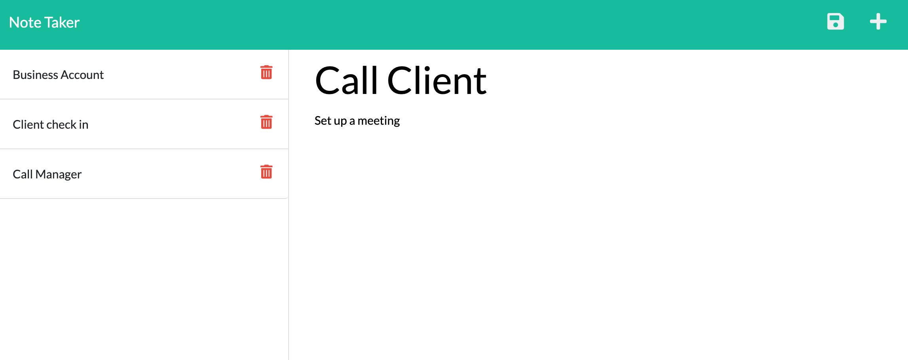

# Note-Taker
Application that can be used to write and save an application that uses back end Express.js back end and saves and retrieves note data from a JSON file.

# Motivation for this project

Learn how to use the db.json file on the back end to store and retrieve notes using the fs module. As well as learn how to connect the front and back end, to deploy an application to Heroku.

# Reason for this project 

 Create an application called Note Taker that can be used to write and save notes.

# What I learned from this project 

In this activity I learnt:

* The step by step breaking down method of the acceptance criteria on HW assignment and the importance of commenting especially after the code has been erased and you cannot remember what was on the code line previously.

* The importance of stackoverflow when trying to figure out what an error message means/what you need fixed. 

* How to modify starter code to create an application called Note Taker that can be used to write and save notes. 

* How to use an Express.js backend to route API requests to save and retrieve note data from a JSON file. 

https://conso97.github.io/Note-Taker/ 

